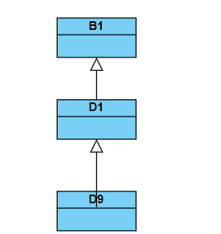

# Exercises 1

## 1. Encapsulation in Java

Encapsulation is a fundamental concept in object-oriented programming (OOP) that involves bundling data (attributes) and methods (functions) into a single unit, known as a class. In Java, encapsulation is implemented using access modifiers such as `private`, `protected`, and `public` to control the visibility of fields and methods within a class.

Example:

```java
public class EncapsulationExample {
    private int data; // Private data field

    public int getData() {
        return data; // Accessor method (getter)
    }

    public void setData(int newData) {
        this.data = newData; // Mutator method (setter)
    }
}
```
In this example, the data field is private, and its access is controlled through getter and setter methods.

# Mutator Method (Setter) and Accessor Method (Getter)

**Mutator Method (Setter):** It is a method used to modify the value of a private field in a class. It typically has the prefix "set" followed by the field name and takes a parameter to set the new value.

```java
 public void setPropVal(int propVal) {
        this.propVal = propVal;
        }
```

**Accessor Method (Getter):** It is a method used to retrieve the value of a private field. It typically has the prefix "get" followed by the field name and returns the value.

`````java
 public int getPropVal() {
        return propVal;
        }
`````
## Meanings/Roles of this and super in Java:

- **Meaning:**
    - `this` refers to the current object instance within a class.

- **Roles:**
    - Used to differentiate instance variables from parameters with the same name.
    - Invoked to access or modify the current object's fields.
    - Invoked to call methods of the current object.

- **Meaning:**
    - `super` refers to the immediate parent class instance.

- **Roles:**
    - Used to invoke methods of the parent class.
    - Accesses fields of the parent class.
    - Invoked to call the constructor of the parent class.

## Inheritance in Java:
Inheritance is a mechanism in Java that allows a class (subclass/child) to inherit properties and behaviors from another class (superclass/parent). It promotes code reuse and establishes a relationship between classes. Inheritance is implemented using the extends keyword.
 ````java
public class ChildClass extends ParentClass {
    // Additional fields and methods in the child class
}

````

## Polymorphism in Java

Polymorphism is the ability of a single entity to take multiple forms. In Java, there are three main forms of polymorphism:

- **Compile-time Polymorphism (Method Overloading):**
  - Multiple methods in the same class with the same name but different parameters.

- **Runtime Polymorphism (Method Overriding):**
  - A subclass provides a specific implementation for a method already defined in its superclass.

- **Interface-based Polymorphism (Interface Implementation):**
  - Objects can be treated as instances of their interface rather than their actual class.

## Relationship between Inheritance and Sub-type/Inclusion Polymorphism

Inheritance enables sub-type polymorphism by allowing objects of a subclass to be treated as objects of the superclass. It ensures that a subclass can be used wherever its superclass is expected. Method overriding in the subclass contributes to this polymorphic behavior.

## Composition vs. Inheritance: How to Choose?

Composition and Inheritance are two ways to achieve code reuse and flexibility in OOP.

- **Composition:**
  - Involves creating relationships between classes by composing them using instance variables.

- **Inheritance:**
  - Involves creating a new class based on an existing class.

The choice between them depends on the specific requirements and design goals of the system.

## Identifying Testable Methods and Writing Unit Tests


# Exercises 2

## Static Variable (Field/Class Member):

A static variable is a class-level variable shared among all instances of the class. It is declared using the `static` keyword.

In the given example: `staticVar` is a static variable, and it is shared among all instances of the `HelloStatic` class.

## Static Constant:

A static constant is a class-level constant that cannot be changed after initialization. It is declared using the `static final` keywords.

In the given example: `STATIC_CONST` is a static constant, and it is marked as `public static final double STATIC_CONST = 1.57079;`.

## Static Method:

A static method is a method that belongs to the class rather than an instance of the class. It is declared using the `static` keyword.

In the given example: `static void staticMethod(HelloStatic hs)` is a static method.

## Why Static Constants Often Have Public Visibility:

Static constants often have public visibility to allow easy access from other classes. Public visibility makes them accessible from anywhere in the code.

Since static constants are usually meant to be universal values shared across the application, making them public allows other classes to use these constants without the need for an instance of the class.

## Why Static Methods Do Not Have Access to Instance Members:

Static methods are associated with the class itself, not with a particular instance. They are called on the class, not on an object.

Instance members (methods and fields) are specific to an instance of the class and require an object to be accessed. Since static methods don't have access to a specific instance, they cannot access instance members directly.

## Example of a Static Method Application:

An example of a static method application is the `Math` class in Java. The methods in the `Math` class are static because they perform operations that are not dependent on a specific instance of the class.

Example: `Math.sqrt(double a)` is a static method that calculates the square root of a given number without needing an instance of the `Math` class.

# Exercises 3
## Object Initialization Process for a Class Derived from the Object Class Default Values for Different Types of Fields/Variables:

### Primitive Types:

- `int`, `byte`, `short`, `long`, `float`, `double`: 0
- `char`: '\u0000'
- `boolean`: false

### Reference Types:

- Objects: null

### Static Variables:
- Initialized to their default values.

### Static Constants:
- Initialized to the specified values.

### Anonymous Static Blocks:
- Executed once when the class is loaded.
- Used for static initialization.

### Anonymous Blocks:
- Executed during object initialization.
- Used for instance initialization.

### Constructors:
- Called during object creation.
- Used for instance initialization.
- Constructors can call other constructors (using this()).

## Sequence of Constructor Calls:
1. *Implicit Call to Superclass Constructor (D1):*
  - The D9 constructor begins with an explicit call to the superclass constructor super().
  - If the super() call is not explicitly provided, the superclass constructor would be called implicitly.
  - Since no arguments are passed to super(), the default constructor of class D1 is invoked.

2. *Initialization of Instance Variables:*
  - Instance variables d1, d4, and d7 are declared and initialized.
  - d4 is initialized with a new instance of class D4 within an instance initialization block.
  - d7 is initialized with a new instance of class D7 directly at the time of declaration.

3. *Constructor Body Execution:*
  - The constructor body of class D9 is executed.
  - The line System.out.println("D9.D9()"); prints a message to indicate that the constructor D9() is being executed.

4. *Instance Variable Initialization (d1):*
  - The line d1 = new D1(); initializes the instance variable d1 with a new instance of class D1.
  - This creates another instance of D1, separate from the instance inherited from the superclass D1.

In summary, the sequence of constructor calls for the class D9 is as follows:
1. Implicit call to superclass constructor (D1).
2. Initialization of instance variables (d4 and d7).
3. Execution of the D9() constructor body.
4. Initialization of instance variable d1 with a new instance of class D1.

## Class Diagram:


## Comparing Capabilities of Constructors and Factory Methods:
### Constructors:
   - Used to create instances of a class.
   - Can be overloaded and called explicitly with the new keyword.
- Cannot have a different name than the class.
   - No control over the returned object type.
### Factory Methods:
   - Static methods used to create instances of a class.
   - Can have different names, allowing for clearer intent.
   - Can return objects of a different type or subtype.
   - Can control the instantiation process.

## Applications of the Singleton Pattern:
### Database Connection Pool:
Ensure a single point of access to a shared resource like a database connection pool.
### Logger Objects:
Ensure that only one instance of a logger is used throughout the application.

## Unit Tests for Singletons in 01_08

#### Example Test for EagerSingleton:
````java
import org.junit.jupiter.api.Test;
import static org.junit.jupiter.api.Assertions.*;

public class EagerSingletonTest {

    @Test
    void getInstance_shouldReturnSameInstance() {
        EagerSingleton instance1 = EagerSingleton.getInstance();
        EagerSingleton instance2 = EagerSingleton.getInstance();

        assertSame(instance1, instance2);
    }
}

````
#### Example Test for LazySingleton:

````java
import org.junit.jupiter.api.Test;
import static org.junit.jupiter.api.Assertions.*;

public class LazySingletonTest {

  @Test
  void getInstance_shouldReturnSameInstance() {
    LazySingleton instance1 = LazySingleton.getInstance();
    LazySingleton instance2 = LazySingleton.getInstance();

    assertSame(instance1, instance2);
  }
}

````

These tests use JUnit 5 and assert that calling getInstance() on a singleton class returns the same instance. *

# Exercises 4
## 1. Strategy for Defining Immutable Objects:

To define immutable objects, you can follow these strategies:

- **Make the class final:** Prevents the class from being extended, ensuring it cannot be subclassed.

- **Make fields private and final:** Restricts direct access to fields and ensures they are set only during object creation.

- **No mutator methods (setters):** Eliminate methods that modify the state of the object after instantiation.

- **Ensure no mutable objects are exposed:** If the class contains references to mutable objects, make sure they are not exposed or provide defensive copies.

- **Provide accessors (getters):** Allow read-only access to the internal state.

- **Make the class and fields final:** If possible, declare the class and fields as final to reinforce immutability.

## 2. Comparison of Immutable Object and Immutable Class:

### .Immutable Object:

- An instance of a class with immutable properties.
- Object state cannot be modified after creation.
- Achieved by making fields private and final, providing only getters, and avoiding mutator methods.

### Immutable Class:

- A class that produces immutable objects.
- The class itself may have mutable state (non-final fields), but instances it creates are immutable.
- Typically involves proper encapsulation and ensuring instances are not modified after creation.

## 3. Advantages of Immutable Objects:

- **Thread Safety:** Immutable objects are inherently thread-safe as their state cannot be changed, reducing the need for synchronization.

- **Simplified Code:** The absence of mutator methods simplifies the code and reduces the chance of bugs related to state changes.

- **Predictable Behavior:** Immutable objects provide a consistent state throughout their lifetime, leading to predictable behavior.

- **Easier Testing:** Immutable objects are easier to test because their state doesn't change, simplifying unit testing.

## 4. Uses of Java Records:

- **Data Transfer Objects (DTOs):** Records are ideal for representing data transfer objects where the primary purpose is to transfer data between different parts of a program or between systems.

- **Immutable Data Structures:** Records are well-suited for representing immutable data structures. They provide a concise syntax for declaring and initializing such structures.

## 5. Unit Tests for `HelloImmutable` and `HelloJavaRecord`:

### Unit Test for `HelloImmutable`:

````java
import org.junit.jupiter.api.Test;
import static org.junit.jupiter.api.Assertions.*;

public class HelloImmutableTest {

    @Test
    void testImmutableObjectCreation() {
        HelloImmutable hello = new HelloImmutable(42, "Hello");
        
        // Test accessor methods
        assertEquals(42, hello.getI1());
        assertEquals("Hello", hello.getS1());
        
        // Test toString method
        assertEquals("HelloImmutable{i1=42, s1='Hello'}", hello.toString());
        
        // Test equality
        HelloImmutable sameHello = new HelloImmutable(42, "Hello");
        assertEquals(hello, sameHello);
        
        // Test immutability (attempting to modify should result in a compilation error)
        // hello.setI1(100);  // Compilation error: cannot assign a value to final variable 'i1'
    }
}

````
## Unit Test for HelloJavaRecord:
````java
import org.junit.jupiter.api.Test;
import static org.junit.jupiter.api.Assertions.*;

public class HelloJavaRecordTest {

    @Test
    void testJavaRecordCreation() {
        HelloJavaRecord helloRecord = new HelloJavaRecord(42, "Hello");
        
        // Test accessor methods
        assertEquals(42, helloRecord.i1());
        assertEquals("Hello", helloRecord.s1());
        
        // Test toString method
        assertEquals("HelloJavaRecord{i1=42, s1='Hello'}", helloRecord.toString());
        
        // Test immutability (attempting to modify should result in a compilation error)
        // helloRecord.i1 = 100;  // Compilation error: cannot assign a value to final field 'i1'
    }
}

````

# Exercises 5

## 1. Difference between Operator and equals Method in Java:

In Java, the `==` operator is used to compare primitive types for equality by comparing their values. For reference types (objects), the `==` operator compares the memory addresses, checking if two references point to the same object.

On the other hand, the `equals` method is a method defined in the `Object` class. It is intended for comparing the contents or attributes of objects. It is recommended to override the `equals` method in user-defined classes to provide a meaningful comparison based on the object's attributes.

For primitive types, `==` compares values, while for objects, `equals` compares the content or attributes of the objects.

## 2. Explanation of the Formula 01.equals(o2) $\implies$ hashCode(01) == hashCode(02):

This formula suggests that if two objects are equal according to their `equals` method, then their hash codes, as returned by the `hashCode` method, must be equal.

This property is important to maintain consistency when using objects in collections like `HashMap` or `HashSet`, where objects are often stored and retrieved based on their hash codes.

## 3. Familiarization with the Java Object Class:

The `Object` class is the root class for all Java classes. It provides basic methods, such as `equals`, `hashCode`, `toString`, and more, which can be overridden in user-defined classes to customize their behavior.

## 4. General Contract of hashCode and equals:

For a well-behaved Java class:

- **equals Method:**
  - Reflexive: `x.equals(x)` should always return true.
  - Symmetric: If `x.equals(y)` is true, then `y.equals(x)` should also be true.
  - Transitive: If `x.equals(y)` is true and `y.equals(z)` is true, then `x.equals(z)` should also be true.
  - Consistent: Multiple invocations of `x.equals(y)` should consistently return the same result, provided that the objects have not changed.
  - Non-nullity: `x.equals(null)` should always return false.

- **hashCode Method:**
  - Consistent: Multiple invocations of `hashCode` on the same object should consistently return the same integer.
  - Equal Objects: If `x.equals(y)` is true, then `x.hashCode()` should equal `y.hashCode()`.
  - Non-nullity: The `hashCode` method should not throw exceptions and should return a valid integer.
